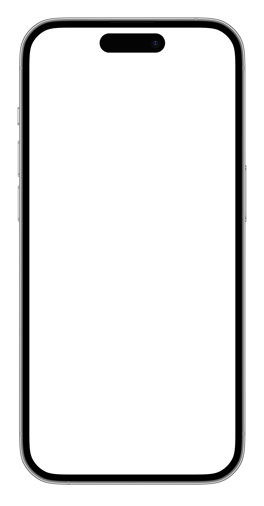
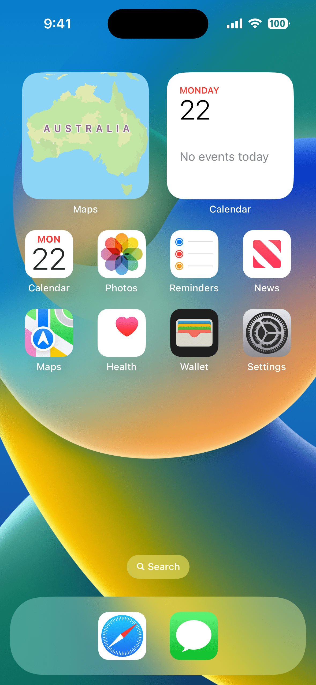
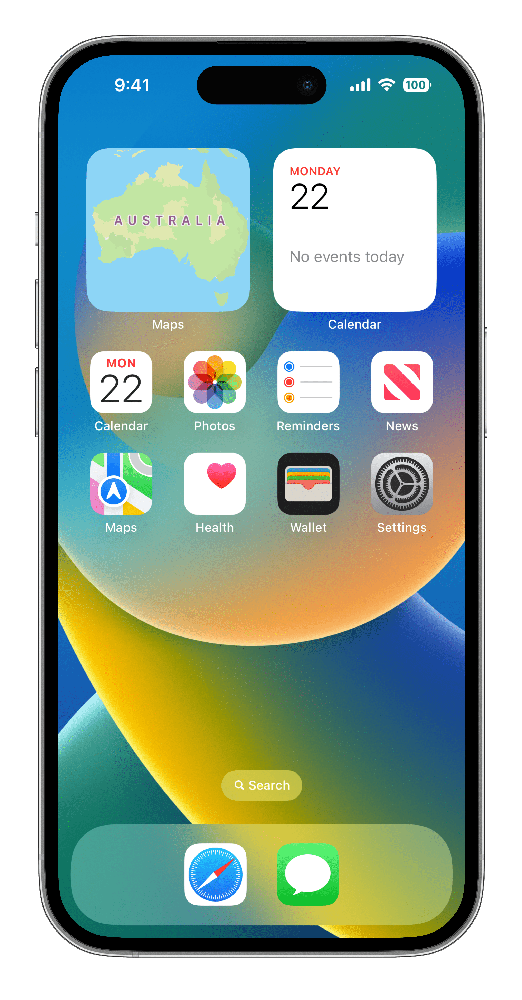
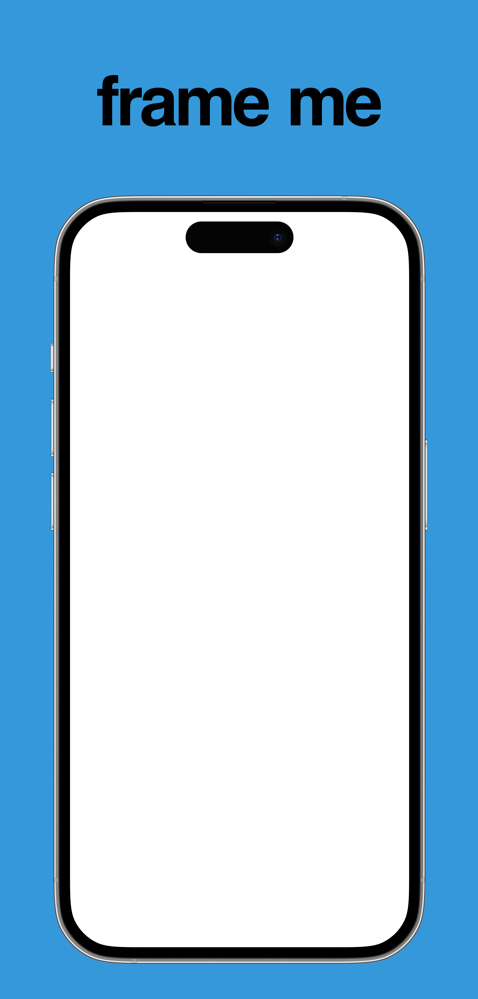
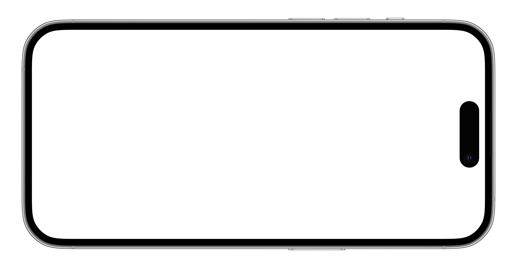
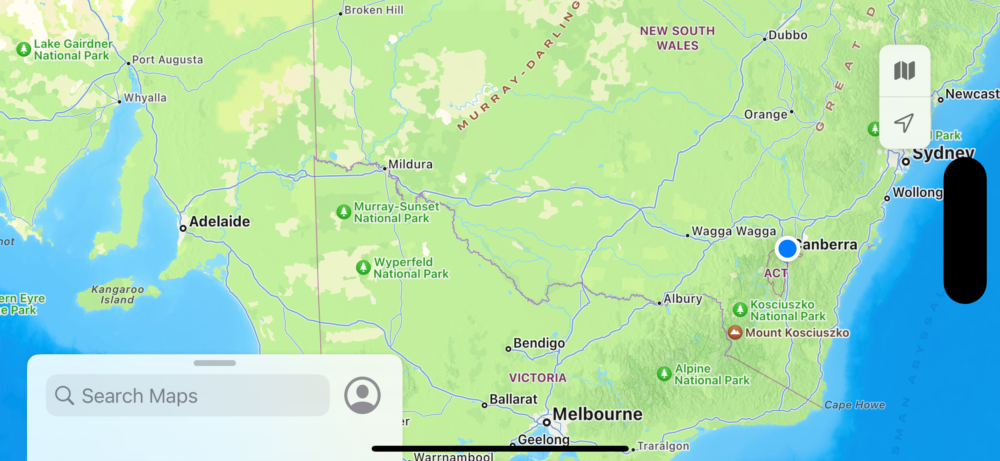

<p style="text-align:center"></p>

Quickly frame screenshots, this is designed to use iOS frames from https://developer.apple.com/design/resources/#product-bezels . This also works with Android, TV, Apple Watch or most other devices frames.

## Examples

| Frame | Screenshot | Output |
|---|---|---|
| <p style="text-align:center">[](.github/artwork/meta-iphone14pro-frame.png)</p> | <p style="text-align:center">[](.github/artwork/iphone14pro.png.png)</p> | <p style="text-align:center">[](.github/artwork/meta-iphone14pro-frame_framed.png)</p> |
| <p style="text-align:center">[](.github/artwork/meta-iphone14pro-text-frame.png)</p> | <p style="text-align:center">[](.github/artwork/iphone14pro.png.png)</p> | <p style="text-align:center">[](.github/artwork/meta-iphone14pro-text-frame_framed.png)</p> |
| [](.github/artwork/meta-iphone14pro-land-frame.png) | <p style="text-align:center">[](.github/artwork/iphone14pro-map.png)</p> | <p style="text-align:center">[](.github/artwork/meta-iphone14pro-land-frame_framed.png)</p> |

## Why?

While [fastlane/frameit](https://docs.fastlane.tools/actions/frameit/) is an excellent screenshot framing tool it relies on device frames from Facebook which often take a long time to receive new device images, this is a simple tool to use the offical Apple device "bezels".

## How does it work?

This is a fairly simple app that first analyses the device frame to determine where the screen is, this is done by starting at the centre pixel and working in each direction to find edges then it compares the X & Y findings to adjust for the curved frame edges.

Following that it creates a mask from the "screen" area that was found, it then applies this mask to the screenshot then overlays the two images.

After which it writes the framed image to the source folder with the suffix `_framed` just like frameit.

Given this uses CoreGraphics it is lightning fast compared to frameit.

## Installation

Download the [latest release](https://github.com/joshluongo/frameme/releases/latest), the provided binary is universal meaning that it supports both Intel and Apple Silicon natively. Put the binary somewhere in your **$PATH**, usually `/usr/local/bin/`.

Eventually I'll add this to Homebrew.

## Usage

```
OVERVIEW: Quickly frame screenshots.

USAGE: frameme [--skip-content-box] [--no-clip] [--force] [--output <output>] <frame> <screenshot> ...

ARGUMENTS:
  <frame>                 The frame to use.
  <screenshot>            The screenshots to process.

OPTIONS:
  --skip-content-box      Don't try and find the content box, just overlay the frame on the screenshot.
  --no-clip               Don't clip the screenshot to the frame.
  --force                 Force framing of file/s. By default files ending with '_framed' are skipped.
  --output <output>       The output folder. By default framed screenshots are
                          placed in the their original folder.
  -h, --help              Show help information.
```
### Example Command

`frameme ~/frames/iPhone\ 14\ Pro\ -\ Space\ Black\ -\ Portrait.png *.png`

## License

GNU General Public License v3.0

Example device frames from Meta - https://design.facebook.com/toolsandresources/devices/
